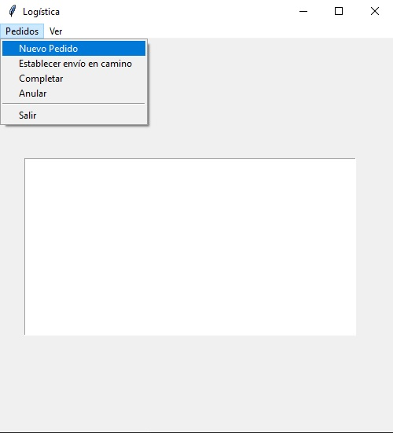
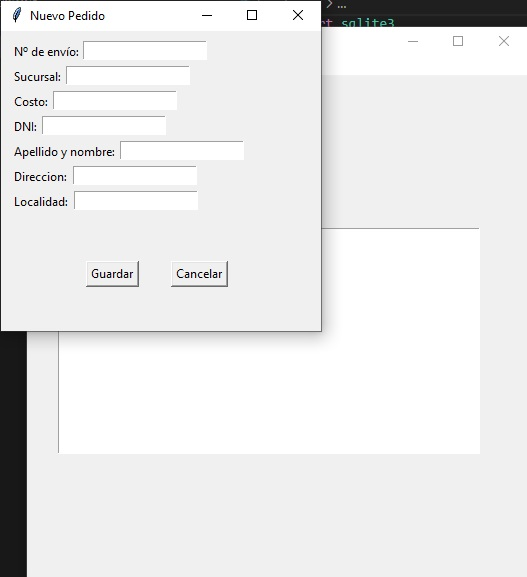
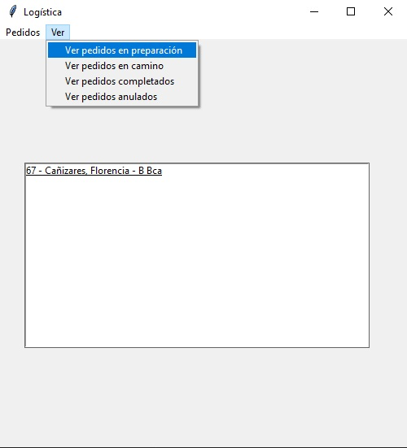
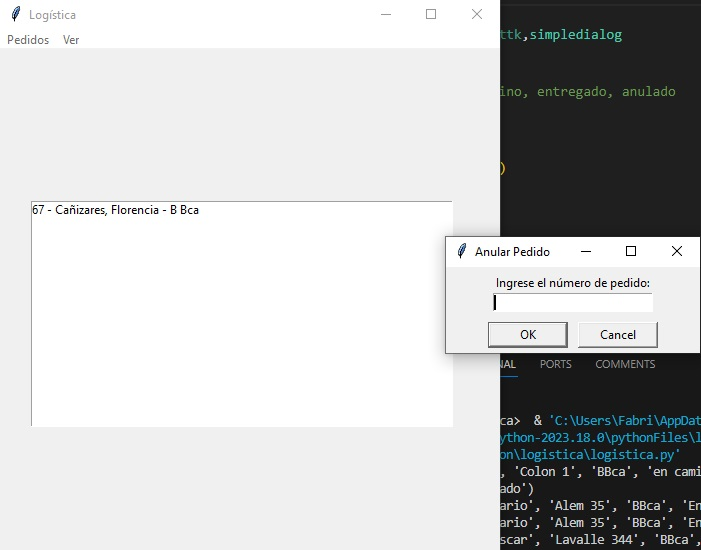

# Gestión de Pedidos de Logística

Este proyecto es un programa de gestión de pedidos de logística que facilita el seguimiento y la administración de pedidos. A continuación, se describen algunas de las características principales del programa.

## Menú "Pedidos"

En la imagen de arriba, puedes ver el menú "Pedidos" desplegado, que ofrece diversas opciones relacionadas con la gestión de pedidos.

## Cargar un Nuevo Pedido

Cuando se abre la ventana para cargar un nuevo pedido, como se muestra en la imagen anterior, se pueden ingresar todos los datos necesarios para registrar un nuevo pedido.

## Menú "Ver"

El menú "Ver" desplegado ofrece opciones para visualizar y revisar pedidos y detalles relacionados con la logística.

## Anular un Pedido

Cuando se selecciona la opción "Anular" en el menú "Pedidos", se despliega una pequeña ventana que solicita ingresar el número de pedido que se desea anular. Esto facilita la gestión de pedidos y la toma de decisiones.